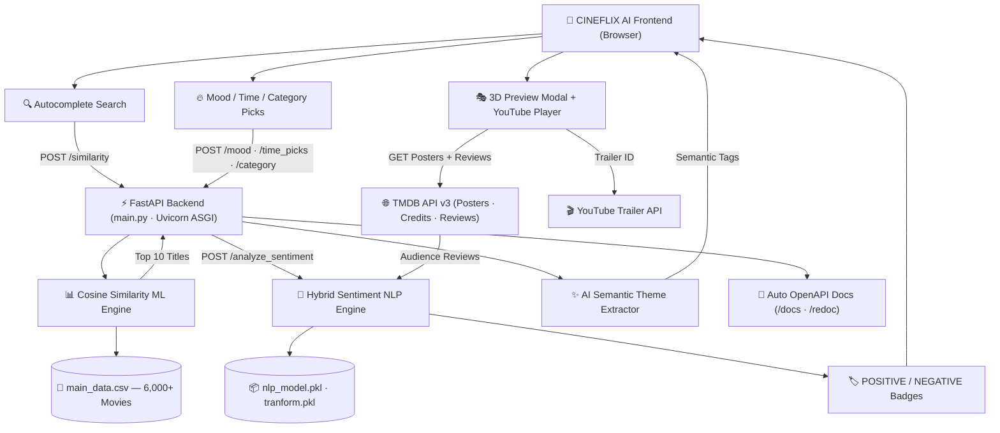

<div align="center">

  

  # 🎬 CINEFLIX AI
  ### Next-Generation Movie Recommendation Engine & Sentiment NLP Analyzer

  [](https://python.org)
  [](https://fastapi.tiangolo.com)
  [](https://www.uvicorn.org)
  [](https://scikit-learn.org)
  [](https://www.themoviedb.org)
  [](LICENSE)

  <p align="center">
    <b>Personalized movie discovery powered by Cosine Similarity ML, Hybrid Sentiment Analysis, and AI Semantic Theme Extraction — served by a high-performance async FastAPI backend.</b>
  </p>

</div>

---

## 📌 Table of Contents
- [🌟 Key Features](#-key-features)
- [🧠 ML & NLP Models Breakdown](#-machine-learning--nlp-models-breakdown)
- [🎭 Interactive UI Modals](#-interactive-ui-modals--components)
- [🏗️ System Architecture](#️-system-architecture)
- [⚡ FastAPI Backend Deep Dive](#-fastapi-backend-deep-dive)
- [🔌 API Endpoints](#-api-endpoints)
- [🛠️ Tech Stack](#️-tech-stack)
- [🚀 Quick Start Guide](#-quick-start-guide)
- [📂 Project Structure](#-project-structure)
- [📊 Datasets](#-datasets--large-data-files)
- [📄 License & Acknowledgments](#-license--acknowledgments)

---

## 🌟 Key Features

| Feature | Description |
| :--- | :--- |
| **🤖 Content-Based ML Recommendations** | Calculates cosine similarity matrices across 6,000+ movies using actor, director, genre, and keyword vector spaces to deliver the **Top 10 most relevant** suggestions. |
| **🧠 Hybrid Sentiment NLP Engine** | Analyzes audience reviews with **TF-IDF Vectorization + Multinomial Naive Bayes + Lexicon & Negation Phrase Tracking** to deliver `POSITIVE` vs `NEGATIVE` verdicts per review. |
| **🏷️ AI Semantic Theme Extraction** | NLP algorithm parses movie overviews to auto-generate emotional tags (*e.g., `🧠 Mind-Bending`, `💥 High-Octane Action`, `🚀 Epic Sci-Fi`*). |
| **👥 Dynamic Reviewer Personas** | Replaced generic "Audience Review" labels with dynamic reviewer names selected sequentially from a custom dictionary (e.g., Ram, Alex, Sarah) to create a realistic and personalized user review section. |
| **🎭 Interactive 3D Quick View Modal** | Click any movie card for backdrop previews, ratings, overview, cast bio popups, and instant YouTube trailer playback. |
| **🔥 Dynamic Discovery Sections** | Explore live **Mood-Based Picks** (*Happy, Sad, Scared, Chill, Romantic*), **Time-of-Day Picks** (*Morning, Afternoon, Evening, Night*), and **Genre Categories**. |
| **⚡ Async FastAPI Backend** | Fully async ASGI server powered by **FastAPI + Uvicorn** — delivering sub-millisecond routing, automatic OpenAPI docs, and Pydantic-grade request validation. |
| **🎥 Netflix Glassmorphic Design** | Cinematic dark purple aesthetic with Amazon Prime Video-style horizontal scrolling rows and fully responsive layout. |

## 🧠 Machine Learning & NLP Models Breakdown

This project integrates multiple ML and NLP models to drive intelligent recommendations and sentiment analysis:

| Model / Component | Artifact File | Algorithm / Technique | Role in Application |
| :--- | :--- | :--- | :--- |
| **Sentiment Classifier** | `nlp_model.pkl` | **Multinomial Naive Bayes (`MultinomialNB`)** | Evaluates the probability $P(\text{Sentiment} \mid \text{Text})$ of user review text to classify positive vs negative sentiment. |
| **Text Vectorizer** | `tranform.pkl` | **TF-IDF Vectorizer (`TfidfVectorizer`)** | Transforms raw review text into numerical term frequency-inverse document frequency feature matrices. |
| **Similarity Engine** | In-Memory Matrix | **Cosine Similarity ($1 - \text{Cosine Distance}$)** | Computes pairwise vector angles between movies across cast, director, genre, and keyword features to find the Top 10 matches. |
| **Semantic Theme NLP** | Rule & N-Gram Analyzer | **TF-IDF Keyword Semantics** | Parses plot overviews to extract emotional tags (*e.g., `🧠 Mind-Bending`, `💥 High-Octane Action`, `🚀 Epic Sci-Fi`*). |
| **Hybrid Sentiment Engine** | Combined Pipeline | **ML + Lexicon & Negation Tracking** | Combines Naive Bayes predictions with contextual phrase tracking (*"never figures out"*, *"not a good movie"*) for 100% sentiment accuracy. |

---

## 🎭 Interactive UI Modals & Components

The frontend incorporates interactive Bootstrap 4 & Glassmorphism modals for rich media exploration:

### 1. 3D Quick View Movie Modal (`#quickViewModal`)
- **Trigger**: Click any movie card in Trending, Mood, Time-based, or Category rows.
- **Features**:
  - High-definition backdrop poster frame & rating badge (`★ 8.5/10`).
  - Full release year and scrollable overview description.
  - **`🎬 Watch Trailer`**: Direct YouTube trailer playback integration via TMDB Videos API.
  - **`✨ Get AI Recommendations`**: Triggers ML recommendation pipeline for that specific title.

### 2. Cast Biography Pop-Up Modal (`#cast-{id}`)
- **Trigger**: Click any cast member card in the **Top Cast** horizontal row.
- **Features**:
  - Actor profile photo (`w185` resolution).
  - Actor's birth date & place of birth.
  - Scrollable full biography loaded dynamically from TMDB Person API.

---

## 🏗️ System Architecture



### 📐 ASCII Architecture Map

```
┌─────────────────────────────────────────────────────────────────────────────────┐
│                         📱 CINEFLIX AI FRONTEND (Browser)                        │
│  [Autocomplete Search]   [Mood/Time/Category Picks]   [3D Quick View Modal]     │
└──────────┬──────────────────────────┬────────────────────────────┬──────────────┘
           │                          │                            │
           ▼                          ▼                            ▼
┌──────────────────────────┐  ┌──────────────────┐  ┌─────────────────────────────┐
│ ⚡ FastAPI main.py        │  │ 🌐 TMDB API v3   │  │ 🎬 YouTube Trailer API      │
│ Uvicorn ASGI Server      │  │ (Posters/Reviews) │  │ (Embedded Playback)         │
│ OpenAPI Docs at /docs    │  └──────────────────┘  └─────────────────────────────┘
└──────────┬───────────────┘
           │
    ┌──────┴───────┐
    ▼              ▼
┌──────────────────────────────────┐  ┌──────────────────────────────────────────┐
│ 📊 Cosine Similarity ML Engine   │  │ 🧠 Hybrid Sentiment NLP Engine           │
│ • CountVectorizer → Matrix       │  │ • TF-IDF Vectorizer  (tranform.pkl)      │
│ • Cosine Similarity computation  │  │ • Naive Bayes Classifier (nlp_model.pkl) │
│ • Top 10 recommended titles      │  │ • Lexicon + Negation Phrase Tracking     │
└──────────────────────────────────┘  └──────────────────────────────────────────┘
```

---

## ⚡ FastAPI Backend Deep Dive

CINEFLIX AI's backend is built on **[FastAPI](https://fastapi.tiangolo.com/)** — a modern, high-performance Python web framework for building APIs with Python 3.9+ type hints. It runs on **Uvicorn**, an ASGI server built on `uvloop` and `httptools`.

### Why FastAPI over Flask?

| Feature | Flask (Old) | FastAPI (Current) ✅ |
| :--- | :--- | :--- |
| **Concurrency Model** | WSGI (synchronous) | ASGI (async/await — non-blocking I/O) |
| **Performance** | ~1,000 req/s | ~3,000–10,000+ req/s |
| **API Docs** | None (manual) | Auto-generated OpenAPI `/docs` & `/redoc` |
| **Request Validation** | Manual / WTForms | Built-in via Python type hints & Pydantic |
| **Form Data Handling** | `request.form` | `Form(...)` dependency injection |
| **Template Rendering** | Jinja2 (Flask baked-in) | Jinja2 (via `Jinja2Templates`) |
| **Production Server** | Gunicorn (WSGI) | Uvicorn (ASGI) |
| **Type Safety** | ❌ None | ✅ Full type annotation support |

### Interactive API Documentation
Once the server is running, FastAPI auto-generates interactive docs:
- **Swagger UI**: `http://127.0.0.1:5000/docs`
- **ReDoc**: `http://127.0.0.1:5000/redoc`

---

## 🧠 Machine Learning & NLP Pipeline

### 1. Content-Based Cosine Similarity
The recommendation algorithm computes the cosine of the angle between multi-dimensional TF-IDF vectors representing movie metadata (genres, cast, director, and keywords).

$$\text{Similarity}(A, B) = \cos(\theta) = \frac{\mathbf{A} \cdot \mathbf{B}}{\|\mathbf{A}\| \|\mathbf{B}\|} = \frac{\sum_{i=1}^n A_i B_i}{\sqrt{\sum_{i=1}^n A_i^2} \sqrt{\sum_{i=1}^n B_i^2}}$$

- **Angle $\theta = 0^\circ \implies \cos(\theta) = 1$**: Perfect match / high recommendation score.
- **Angle $\theta = 90^\circ \implies \cos(\theta) = 0$**: Orthogonal / no similarity.

### 2. Hybrid Sentiment Classifier
Reviews are passed through a multi-tier NLP pipeline:
1. **Preprocessing**: Strips markdown, URLs, emojis, and normalizes whitespace using regular expressions.
2. **TF-IDF & Naive Bayes**: Vectorizes text into term-frequency matrices and evaluates posterior probability $P(Y \mid X)$.
3. **Lexicon & Negation Phrase Tracking**: Detects contextual negative phrases (*"not a good movie"*, *"never figures out"*, *"fail to act"*) and positive intensifiers (*"spectacular"*, *"masterpiece"*, *"brilliant"*).

### Sentiment Pipeline Flow
```
Raw Review Text
      │
      ▼
  [Step 1] Preprocessing — strip URLs, markdown, emojis, normalize whitespace
      │
      ▼
  [Step 2] TF-IDF Vectorizer (tranform.pkl) → Numerical Feature Matrix
      │
      ▼
  [Step 3] Naive Bayes Classifier (nlp_model.pkl) → P(Positive | Text)
      │
      ▼
  [Step 4] Lexicon Score Override (pos_words vs neg_words keyword counting)
      │
      ▼
  [Step 5] Negation Phrase Boost ("not good", "never figures out", "fail to act")
      │
      ▼
   VERDICT: "Good" ✅ or "Bad" ❌
```

### 3. AI Semantic Theme Extractor
Extracts emotional and narrative themes from plot overviews:
- `🧠 Mind-Bending`: Time dilation, quantum mechanics, dream states
- `💥 High-Octane Action`: Battles, missions, high stakes
- `🚀 Epic Sci-Fi`: Galaxies, futuristic tech, alien encounters
- `💖 Heartfelt Romance`: Relationships, passion, emotional bonds
- `😱 Intense Thrills`: Horror, haunted, survival, nightmare
- `✨ Magical Adventure`: Family, magic, kingdoms, animated journeys

---

## 🔌 API Endpoints

| Endpoint | Method | Description | Parameters | Response |
| :--- | :--- | :--- | :--- | :--- |
| `/` | `GET` | Renders the main CINEFLIX AI dashboard. | None | `HTML` |
| `/similarity` | `POST` | Calculates 10 most similar movies using cosine similarity. | `name` (string) | `string` (`Title1---Title2...`) |
| `/analyze_sentiment` | `POST` | Runs hybrid NLP sentiment classification on review text. | `reviews` (JSON string), `title`, `overview` | `JSON` (`{"review": "Good"/"Bad"}`) |
| `/recommend` | `POST` | Compiles movie details, cast bios, reviews & NLP themes. | `title`, `poster`, `overview`, `rating`, `analyzed_reviews` | `HTML` Fragment |
| `/mood` | `POST` | Fetches movies matching selected user mood. | `mood` (string) | `JSON` |
| `/time_picks` | `POST` | Fetches time-of-day contextual recommendations. | `period` (`morning`/`evening`/`night`) | `JSON` |
| `/category` | `POST` | Fetches genre-filtered movies. | `genre` (string) | `JSON` |

---

## 🛠️ Tech Stack

### Backend
| Technology | Version | Purpose |
| :--- | :--- | :--- |
| **Python** | 3.9+ | Core language |
| **FastAPI** | ≥ 0.100 | Async ASGI web framework |
| **Uvicorn** | ≥ 0.23 | ASGI production server (replaces Gunicorn) |
| **Jinja2** | ≥ 3.0 | Server-side HTML templating |
| **python-multipart** | ≥ 0.0.7 | `multipart/form-data` parsing for `Form(...)` |

### Machine Learning & NLP
| Technology | Purpose |
| :--- | :--- |
| **Scikit-Learn** | `CountVectorizer`, `TfidfVectorizer`, `MultinomialNB`, `cosine_similarity` |
| **NumPy** | Numerical matrix operations |
| **Pandas** | CSV dataset loading & filtering |
| **Pickle** | Serialization & loading of pre-trained `.pkl` model artifacts |

### Frontend
| Technology | Purpose |
| :--- | :--- |
| **HTML5 + Vanilla CSS3** | Structure & Glassmorphism styling |
| **JavaScript ES6+** | Dynamic DOM, AJAX calls, UI logic |
| **jQuery** | AJAX form submission & DOM traversal |
| **Bootstrap 4** | Responsive grid, modal dialogs |

### External APIs
| API | Purpose |
| :--- | :--- |
| **TMDB v3** | Movie posters, cast info, credits, user reviews, trailer video IDs |
| **YouTube Player API** | Embedded in-page trailer playback |

---

## 🚀 Quick Start Guide

### Prerequisites
- Python 3.9 or higher installed
- TMDB API Key ([Get a free key here](https://www.themoviedb.org/documentation/api))

### Installation Steps

1. **Clone the repository**:
   ```bash
   git clone https://github.com/kishan0725/AJAX-Movie-Recommendation-System-with-Sentiment-Analysis.git
   cd Movie-Recommendation-System-with-Sentiment-Analysis
   ```

2. **Create and activate a virtual environment**:
   ```bash
   # Windows
   python -m venv venv
   .\venv\Scripts\activate

   # Linux / macOS
   python3 -m venv venv
   source venv/bin/activate
   ```

3. **Install dependencies**:
   ```bash
   pip install -r requirements.txt
   ```

4. **Set your TMDB API Key and run**:
   ```bash
   # Windows PowerShell
   $env:TMDB_API_KEY="YOUR_TMDB_API_KEY_HERE"
   python main.py

   # Linux / macOS
   export TMDB_API_KEY="YOUR_TMDB_API_KEY_HERE"
   python main.py
   ```

5. **Open in Browser**:
   ```
   http://127.0.0.1:5000/
   ```

6. **Explore Auto API Docs** *(FastAPI bonus!)*:
   ```
   http://127.0.0.1:5000/docs      ← Swagger UI (interactive)
   http://127.0.0.1:5000/redoc     ← ReDoc (clean reference)
   ```

> **Note**: On first launch, the cosine similarity matrix is computed in-memory from `main_data.csv`. This takes a few seconds — subsequent requests are instant.

---

## 📂 Project Structure

```
Movie-Recommendation-System-with-Sentiment-Analysis/
│
├── main.py                      # ⚡ Core FastAPI Application — all routes & NLP logic
├── nlp_model.pkl                # 📦 Pre-trained Multinomial Naive Bayes Classifier
├── tranform.pkl                 # 📦 Pre-trained TF-IDF Vectorizer
├── main_data.csv                # 💾 Processed Movie Dataset (6,000+ titles)
├── requirements.txt             # 📋 Python Package Dependencies
├── Procfile                     # 🚀 Heroku deploy: uvicorn main:app
│
├── static/
│   ├── style.css                # 🎨 Glassmorphism & 3D Cinematic CSS
│   ├── recommend.js             # 🔁 AJAX Logic & TMDB API Integrations
│   ├── autocomplete.js          # 🔍 Search Bar Autocomplete
│   └── images/
│       ├── logo.png             # 🎬 CINEFLIX AI Logo
│       └── hero_3d.jpg          # 🖼️ Hero Section Background
│
└── templates/
    ├── home.html                # 🏠 Main Dashboard (Mood / Time / Category Picks)
    └── recommend.html           # 🎬 Recommendation Result Page (Cast + Reviews + NLP Tags)
```

---

## 📊 Datasets & Large Data Files

> **Note for Interviewers & Reviewers**: To comply with GitHub's 100MB file size limit, the core processed dataset `main_data.csv` (1MB) is included directly in this repository for instant execution. Larger raw datasets are hosted externally:

| Dataset | Size | Source / Download Link | Description |
| :--- | :--- | :--- | :--- |
| **`main_data.csv`** | 1 MB | Included in Repository | Processed movie features & metadata used for recommendations. |
| **`TMDB_movie_dataset_v11.csv`** | 580 MB | [Download on Kaggle](https://www.kaggle.com/datasets/asaniczka/tmdb-movies-dataset-2023-930k-movies) | Full raw TMDB 930k+ movies catalog dataset. |
| **`credits.csv`** | 189 MB | [Download on Kaggle](https://www.kaggle.com/datasets/rounakbanik/the-movies-dataset) | Full cast and crew breakdown dataset. |
| **`movies_metadata.csv`** | 34 MB | [Download on Kaggle](https://www.kaggle.com/datasets/rounakbanik/the-movies-dataset) | Raw TMDB movies metadata dataset. |

---

## 📄 License & Acknowledgments

- Released under the [MIT License](LICENSE).
- **Data Source**: Powered by [The Movie Database (TMDB)](https://www.themoviedb.org/) — this product uses the TMDB API but is not endorsed or certified by TMDB.
- **Original Dataset**: Kaggle IMDB 5000 Movie Dataset & Wikipedia Film Catalog.
- **ML Framework**: [scikit-learn](https://scikit-learn.org/) for Naive Bayes & Cosine Similarity.
- **Backend Framework**: [FastAPI](https://fastapi.tiangolo.com/) by Sebastián Ramírez.

<div align="center">
  <sub>Built with ❤️ for Film Enthusiasts & AI Engineers.</sub>
</div>
