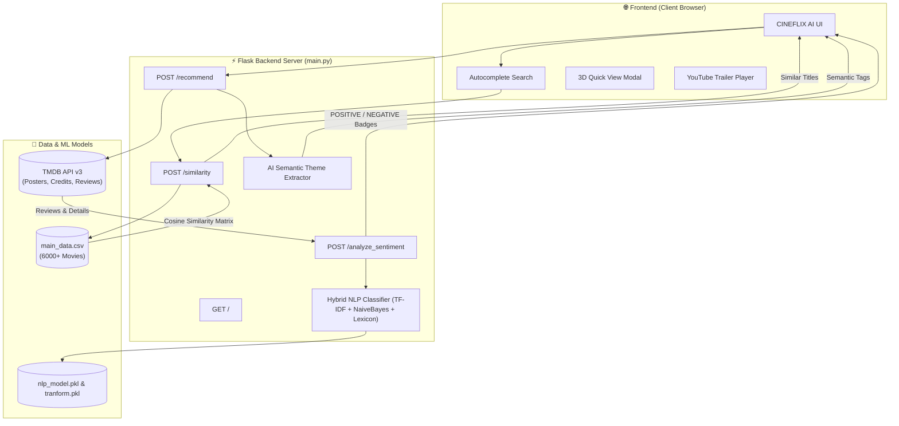

<div align="center">

  

  # 🎬 CINEFLIX AI
  ### Next-Generation Movie Recommendation Engine & Sentiment NLP Analyzer

  [](https://python.org)
  [](https://flask.palletsprojects.com)
  [](https://scikit-learn.org)
  [](https://www.themoviedb.org)
  [](LICENSE)

  <p align="center">
    <b>Personalized movie discovery powered by Cosine Similarity ML, hybrid Sentiment Analysis, and AI Semantic Theme Extraction.</b>
  </p>

</div>

---

## 📌 Table of Contents
- [🌟 Key Features](#-key-features)
- [🏗️ System Architecture](#️-system-architecture)
- [🧠 Machine Learning & NLP Pipeline](#-machine-learning--nlp-pipeline)
  - [1. Content-Based Cosine Similarity](#1-content-based-cosine-similarity)
  - [2. Hybrid Sentiment Classifier](#2-hybrid-sentiment-classifier)
  - [3. AI Semantic Theme Extractor](#3-ai-semantic-theme-extractor)
- [🔌 API Endpoints](#-api-endpoints)
- [🛠️ Tech Stack](#️-tech-stack)
- [🚀 Quick Start Guide](#-quick-start-guide)
- [📂 Project Structure](#-project-structure)
- [📄 License & Acknowledgments](#-license--acknowledgments)

---

## 🌟 Key Features

| Feature | Description |
| :--- | :--- |
| **🤖 Content-Based ML Recommendations** | Calculates cosine similarity matrices across 6,000+ movies using actor, director, genre, and keyword vector spaces. |
| **🧠 Hybrid Sentiment NLP Engine** | Analyzes audience reviews with TF-IDF Vectorization + Naive Bayes + Lexicon & Negation Phrase Tracking to deliver `POSITIVE` vs `NEGATIVE` verdicts. |
| **🏷️ AI Semantic Theme Extraction** | Natural Language Processing algorithm parses movie overviews to auto-generate emotional tags (*e.g., `🧠 Mind-Bending`, `💥 High-Octane Action`, `🚀 Epic Sci-Fi`*). |
| **🎭 Interactive 3D Quick View** | Click any movie card for backdrop previews, ratings, overview, cast bio popups, and instant YouTube trailer playback. |
| **🔥 Dynamic Discovery Sections** | Explore live **Trending Now**, **Mood-Based Picks** (*Happy, Sad, Scared, Chill*), **Time-of-Day Picks** (*Morning, Evening, Night*), and **Categories**. |
| **🎥 Netflix Glassmorphic Design** | Cinematic dark purple aesthetic with Amazon Prime Video horizontal scrolling rows and responsive layout. |

---

## 🏗️ System Architecture



---

## 🧠 Machine Learning & NLP Pipeline

### 1. Content-Based Cosine Similarity
The recommendation algorithm computes the cosine of the angle between multi-dimensional TF-IDF vectors representing movie metadata (genres, cast, director, and keywords).

$$\text{Similarity}(A, B) = \cos(\theta) = \frac{\mathbf{A} \cdot \mathbf{B}}{\|\mathbf{A}\| \|\mathbf{B}\|} = \frac{\sum_{i=1}^n A_i B_i}{\sqrt{\sum_{i=1}^n A_i^2} \sqrt{\sum_{i=1}^n B_i^2}}$$

- **Angle $\theta = 0^\circ \implies \cos(\theta) = 1$**: Perfect match / high recommendation score.
- **Angle $\theta = 90^\circ \implies \cos(\theta) = 0$**: Orthogonal / no similarity.

### 2. Hybrid Sentiment Classifier
Reviews are passed through a multi-tier NLP pipeline:
1. **Preprocessing**: Strips markdown, URLs, emojis, and normalizes whitespace using regular expressions.
2. **TF-IDF & Naive Bayes**: Vectorizes text into term-frequency matrices and evaluates posterior probability $P(Y \mid X)$.
3. **Lexicon & Negation Phrase Tracking**: Detects contextual negative phrases (*"not a good movie"*, *"never figures out"*, *"fail to act"*) and positive intensifiers (*"spectacular"*, *"masterpiece"*, *"brilliant"*).

### 3. AI Semantic Theme Extractor
Extracts emotional and narrative themes from plot overviews:
- `🧠 Mind-Bending`: Time dilation, quantum mechanics, dream states
- `💥 High-Octane Action`: Battles, missions, high stakes
- `🚀 Epic Sci-Fi`: Galaxies, futuristic tech, alien encounters
- `💖 Heartfelt Romance`: Relationships, passion, emotional bonds

---

## 🔌 API Endpoints

| Endpoint | Method | Description | Parameters | Response |
| :--- | :--- | :--- | :--- | :--- |
| `/` | `GET` | Renders the main CINEFLIX AI dashboard. | None | `HTML` |
| `/similarity` | `POST` | Calculates 10 most similar movies using cosine similarity. | `name` (string) | `string` (`Title1---Title2...`) |
| `/analyze_sentiment` | `POST` | Runs hybrid NLP sentiment classification on review text. | `reviews` (JSON string), `title`, `overview` | `JSON` (`{"review": "Good"/"Bad"}`) |
| `/recommend` | `POST` | Compiles movie details, cast bios, reviews & NLP themes. | `title`, `poster`, `overview`, `rating`, `analyzed_reviews` | `HTML` Fragment |
| `/mood` | `POST` | Fetches movies matching selected user mood. | `mood` (string) | `JSON` |
| `/time_picks` | `POST` | Fetches time-of-day contextual recommendations. | `period` (`morning`/`evening`/`night`) | `JSON` |
| `/category` | `POST` | Fetches genre-filtered movies. | `genre` (string) | `JSON` |

---

## 🛠️ Tech Stack

- **Backend**: Python 3.9+, Flask, Scikit-Learn, Pandas, NumPy, Pickle
- **Machine Learning & NLP**: CountVectorizer, TF-IDF Vectorizer, Multinomial Naive Bayes, Cosine Similarity
- **Frontend**: HTML5, Vanilla CSS3 (Glassmorphic Theme), JavaScript (ES6+), jQuery, Bootstrap 4
- **External Data & Media**: The Movie Database (TMDB v3 API), YouTube Data API

---

## 🚀 Quick Start Guide

### Prerequisites
- Python 3.9 or higher installed
- TMDB API Key ([Get a free key here](https://www.themoviedb.org/documentation/api))

### Installation Steps

1. **Clone the repository**:
   ```bash
   git clone https://github.com/kishan0725/AJAX-Movie-Recommendation-System-with-Sentiment-Analysis.git
   cd Movie-Recommendation-System-with-Sentiment-Analysis
   ```

2. **Create and activate a virtual environment**:
   ```bash
   # Windows
   python -m venv venv
   .\venv\Scripts\activate

   # Linux / macOS
   python3 -m venv venv
   source venv/bin/activate
   ```

3. **Install dependencies**:
   ```bash
   pip install -r requirements.txt
   ```

4. **Set environment variables & run the app**:
   ```bash
   # Windows PowerShell
   $env:TMDB_API_KEY="YOUR_TMDB_API_KEY"
   python main.py

   # Linux / macOS
   export TMDB_API_KEY="YOUR_TMDB_API_KEY"
   python main.py
   ```

5. **Open in Browser**:
   Navigate to `http://127.0.0.1:5000/`

---

## 📂 Project Structure

```
Movie-Recommendation-System-with-Sentiment-Analysis/
├── main.py                      # Core Flask Application & NLP Routing
├── nlp_model.pkl                # Pre-trained Naive Bayes Classifier Model
├── tranform.pkl                 # Pre-trained TF-IDF Vectorizer
├── main_data.csv                # Processed Movie Dataset (6000+ titles)
├── requirements.txt             # Python Package Dependencies
├── static/
│   ├── style.css                # CINEFLIX AI Glassmorphism & 3D CSS
│   ├── recommend.js             # AJAX Logic & TMDB API Integrations
│   ├── autocomplete.js          # Search Bar Autocomplete Listener
│   └── images/
│       ├── logo.png             # Custom 3D CINEFLIX AI Logo
│       └── hero_3d.jpg          # Cinematic Hero Asset
└── templates/
    ├── home.html                # Main Dashboard View
    └── recommend.html           # AJAX Recommendation Fragment
```

---

## 📊 Datasets & Large Data Files

> **Note for Interviewers & Reviewers**: To comply with GitHub's 100MB file size limit, the core processed dataset `main_data.csv` (1MB) is included directly in this repository for instant execution. Larger raw datasets are hosted externally:

| Dataset | Size | Source / Download Link | Description |
| :--- | :--- | :--- | :--- |
| **`main_data.csv`** | 1 MB | Included in Repository | Processed movie features & metadata used for recommendations. |
| **`TMDB_movie_dataset_v11.csv`** | 580 MB | [Download on Kaggle](https://www.kaggle.com/datasets/asaniczka/tmdb-movies-dataset-2023-930k-movies) | Full raw TMDB 930k+ movies catalog dataset. |
| **`credits.csv`** | 189 MB | [Download on Kaggle](https://www.kaggle.com/datasets/rounakbanik/the-movies-dataset) | Full cast and crew breakdown dataset. |
| **`movies_metadata.csv`** | 34 MB | [Download on Kaggle](https://www.kaggle.com/datasets/rounakbanik/the-movies-dataset) | Raw TMDB movies metadata dataset. |

---

## 📄 License & Acknowledgments

- Released under the [MIT License](LICENSE).
- **Data Source**: Powered by [The Movie Database (TMDB)](https://www.themoviedb.org/).
- **Original Dataset**: Kaggle IMDB 5000 Movie Dataset & Wikipedia Film Catalog.

<div align="center">
  <sub>Built with ❤️ for Film Enthusiasts & AI Engineers.</sub>
</div>
